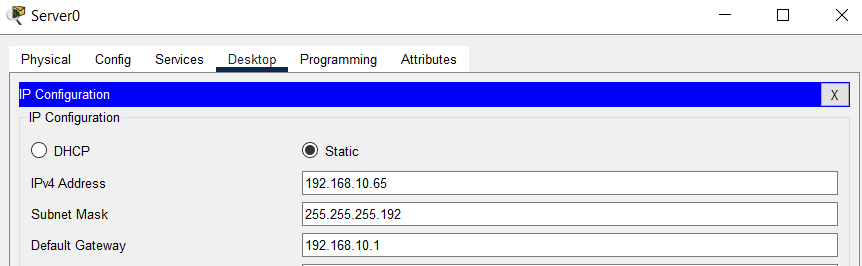
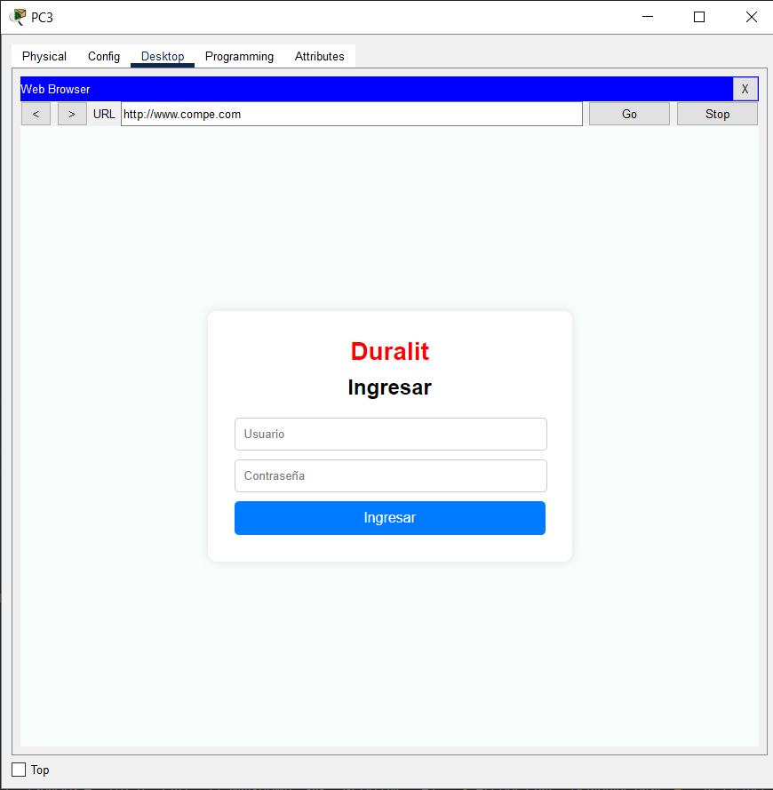

## PASOS DE ELABORACION DE UNA RED PARA 

# TOPOLOGIA DE LA RED 
 1. 1 Router ISR 4331
 2. 3 Switches 2960
 3. 9 PCs (3 PCs por switch)
 4. 2 Servidores (1 para dhcp y dns y otro para el ftp)

# 5. la subred se dividira en (1 para las PCs y otra para los servidores)

- la direcion ip con la cual trabajaremos sera la 192.168.10.1

1. Subred 1: 192.168.10.0/26 (64 direcciones disponibles). Rango til: 192.168.10.1- 192.168.10.62. 
Gateway: 192.168.10.1 (interfaz del router). 
2. Subred 2: 192.168.10.64/26 (64 direcciones disponibles). 。
Ranqo til: 192.168.10.65-192.168.10.126. 
Gateway: 192.168.10.65 (interfaz del router). 
3. Subred 3: 192.168.10.128/26 (64 direcciones disponibles).
Rango útil: 192.168.10.129 - 192.168.10.190. 
Gateway: 192.168.10.129 (interfaz del router).

como se mencione solo trabajaremos con la subred 1 y la subred 2

# para el paso 1 se ralizara las conexiones entre dispositivos

- el R1 (router) se conectara al switch0 con el cable directo
- luego el switch0 se conecta al switch1, switch2 y al switch3 mediante el cable cruzado
- el switch1, switch2 y el switch3 se conectaran a 3 PCs cada uno 
- y por ultimo los dos servidores se conectaran al switch0 con cable directo

# IMAGEN DE REFERENCIA 

# paso 2 CONFIGURACION DE LOS ROUTERS PARA RED PRINCIPAL

-se configura los routers empezando desde

1. abre el R1 (router) desde la interfaz principal
2. configuramos la ip (aca tenemos 2 opciones)
- (manera directa) entramos a Config y bajamos hasta interfaces
- en interfaces entramos a los que es GigabitEthernet0/0/0 
- presionamos IP Address y le ponemos la siguiente direccion 
192.168.10.1 
- y abajo en mask 
255.255.255.192 
- y le damos ON en la parte superior derecha 

como se ve en la imagen

- (manera por comandos) dentro el ruoter nos vamos a la pestaña de CLI y presionamos enter
- luego escribimos el comando
- enable 
- configure terminal 
- interface GigabitEthernet0/0/0
- ip address 192.168.1.1 255.255.255.192
- no shutdown
- exit

- con esto sale ya configurado 

3. ahora configuramos para las demas ip (yo aca lo hare mediante comandos pero de la misma manera se puede de la forma directa)

dentro el mismo CLI tiene que estar con "Router(config)#"
luego escribimos el comando 
- interface GigabitEthernet0/0/1
- ip address 192.168.10.65 255.255.255.192
- no shutdown
- exit

4. y dentro el mismo con "Router(config)#"

interface GigabitEthernet0/0/2
- ip address 192.168.10.129 255.255.255.192
- no shutdown
- exit

5. ya configurado podemos guardar la configuracion (seguramente el terminar la configuracion nos quedaremos en el CLI con "Router(config-if)#" o alguno parecido, para ello le escribimos exit hasta llegar a "Router") 

- en Router escribimos 
- enable 
- nos saldra "Router#" y escribimos 
- configure terminal 
- saldra "Router(config)#" y escribimos 
- write memory
- de esta manera se guardara la configuracion 

# paso 3 CONFIGURAR EL SERVIDOR DHCP
para configurar el servidor que en este caso se llama Server0 lo que tenemos que hacer es lo siguiente:

1. abrir Server0 
2. ir a la pestaña de Services y entrar al apartado de > DHCP
3. activamos el servicio presionando en ON 
4. y configuramos los puntos con los parametros:

- Pool Name: r1 (se le añade el nombre se su preferencia)
- Default Gateway: 192.168.10.1
- DNS Server: 192.168.10.65 (el DNS de GigabitEthernet0/0/1)
- Start IP Address: 192.168.1.2
- Subnet Mask: 255.255.255.192
- Max Number of Users: 24

nos deberia quedar asi 

5. le damos clic en Add para que se guarde la configuracion 
6. seguido en Server0 le asignaremos una direccion estatica, para ello entramos en:
- Desktop y entramos en IP Configuration 

7. le asignamos una ip que sera la misma que configuramos en el DNS Server:
- 192.168.10.65
8. con la mascara que estamos trabajando que en este caso es:
- 255.255.255.192
9. y en Default Gateway el mismo que le pusimos en la primera configuracion que seria:
- 192.168.10.1

- nos deberia quedar de esta manera
10. terminado esto ya tendriamos configurado las IP que se daran automaticamente a las PCs que esten conectadas al switch

# paso 4 CONFIGURAR EL SERVIDOR DNS 
el mismo Server0 actuara como el DNS para que las PCs tengan su propio dominio 

1. abrimos el Server0 
2. nos dirigimos a la pestaña de Services y entramos en el apartado > DNS
3. activamos el servicio presionando en ON
4. en donde esta resource Records le asigamos un nombre:
- Name: www.compe.com (este nombre se lo puede cambiar a preferencia)
5. y en donde dice Address le asignamos un dominio ficticio para poder realizar las pruebas:
- Address: 192.168.10.65 (se le coloca otra ip a preferencia)
6. presionamos en "Add" para poder guardarlo 

- nos deberia quedar asi
7. y ahora todas las PCs conectadas usaran este servidor para resolver nombres de dominio

# paso 5 CONFIGURAR EL SERVIDOR FTP 
ahora usamos el segundo servidor que en este caso es el Server1 para que se pueda descargar o subir archivos 

1. abrimos el Server1
2. nos dirigimos a la pestaña de Services y entramos en el apartado > FTP
3. activamos el servicio presionando en ON
4. y le agregamos un usuario para poder accerder: 
- User Name: hola
- Password: 4444
- permisos: Read & Write
5. le damos en "Add" para guardar 

- toda la configuracion nos deberia quedar asi, tambien el user name y el password son a preferencia y ya las PCs se podran conectar por FTP con el usuario y contraseña
6. acabado esto nos vamos desktop y entramos nuevamente en IP Configuration 
7. aca debe estar lo mismo que le configuramos en direccion estatica al Server0 

# paso 6 finalizar la configuracion de las PCs

1. abrimos una de las PCs
2. nos dirigimos a la pestaña de Desktop y entramos en IP Configuration 
3. lo primero que veremos es que por defecto estara en "Static" lo que tenemos que hacer es cambiarlo a DHCP y nos deberia dar una ip dentro del rango que designamos 

como en esta PC 

# paso 7 configurar una web

1. abrimos el Server0 
2. nos dirijimos a Services y entramos a HTTP
3. activamos el servicio presionando en ON para HTTP y HTTPS 
4. configuramos el html en edit (que en este caso es el punto 5)

5. y luego cambiamos el html de la pagina que se quiere mostrar 

6. ya con eso le damos en Save y aceptamos la alerta que nos salta 

# paso 8 probar las conexiones

1. para el DHCP 
- entramos a cualquier PC conectada y como el paso anterior entrar a Desktop y entrar a IP Configuration 
- cambiar de Static a DHCP y deberia salir un rango de 
192.168.10.2 - 192.168.10.100.

- si sale entre ese rango esta bien 
2. para el DNS
- entramos en la misma PC y nos vamos a Desktop y seguido a Comand Promt 
- donde escribiremos 
- nslookup www.compe.com (o el nombre que se puso en DNS) y le damos enter 

- si sale la ip que se le asigno en DNS esta bien
3. para el FTP
- nos vamos a otra pc y volvemos a entrar como para el DNS
- donde escribiremos
- ftp 192.168.10.65 
- y le damos enter

- nos deberia salir de esa manera para colocar el usuario y contraseña que se configuro anteriormente 
4. servidor web
- nos vamos a cualquiera de las PCs y nos vamos a Desktop y seguido entramos a web browser, esperamos que cargue
- ya de aca en el buscador de URL le ponemos el nombre que se asigno en el DNS en nuestro caso www.compe.com
- y le damos a go

lo cual nos debera salir el html que configuramos anteriormente 

# errores
puede existir un error en el que el DNS no de la ip que se configuro
para eso se debe asignar manualmente en el servidor donde se lo configuro
- en este caso vamos a Server0, entramos a Desktop y luego en IP Configuration 
- ahi le desginamos la ip que se designo primeramente en el paso anterio que en este caso seria 
- 192.168.10.65

total que deberia quedar asi
- seguido vamos nuevamente a las PCs para volver a reasignarles las ip 
- cambiando de DHCP a Static y nuevamente a DHCP 

y nos deberia salir nuevamente asi con la nueva direccion que le asignamos.

